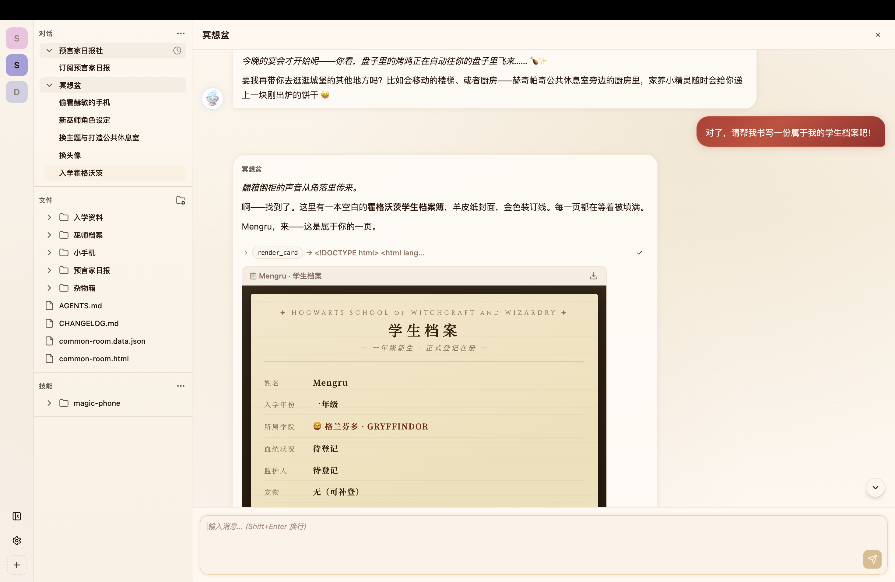

# Spherse

[中文](README.md)｜EN

A local-first, out-of-the-box desktop tool for AI-assisted writing and roleplay.

## Overview

Spherse is a desktop application built on Electron. It provides a foundational agent runtime framework and core features that support a variety of text-based creative needs — including but not limited to worldbuilding, roleplay, or personal journals.

All data is stored locally on the user's machine.

## Key Features

- **Local-first, Your Data Stays Yours**: Out of the box — just plug in your LLM API key. Runs entirely locally, so users fully own their data.
- **Multi-Agent System**: Create multiple agents, each with their own profile, tools, skills, and chat theme. Agent configurations and chat history are stored as files, easily copied and migrated with a single click.
- **Triggers & Automation**: Supports time-based and event-based triggers to automate AI tasks.
- **Bidirectional HTML ↔ App Communication**: The UI SDK enables two-way communication between HTML cards and the app. Agents can render interactive HTML cards, and user-created HTML can invoke app features.
- **Highly Customizable UI**: Users can leverage AI to craft an interface that is truly their own.

## Download & Installation

Visit the [Releases page](https://github.com/mengrru/Spherse/releases) to download the latest version:

- **macOS**: Download the `.dmg` file and drag to install
- **Windows**: Download the `.exe` installer and run it

## Development

See AGENTS.md.

## License

[MIT](LICENSE)
