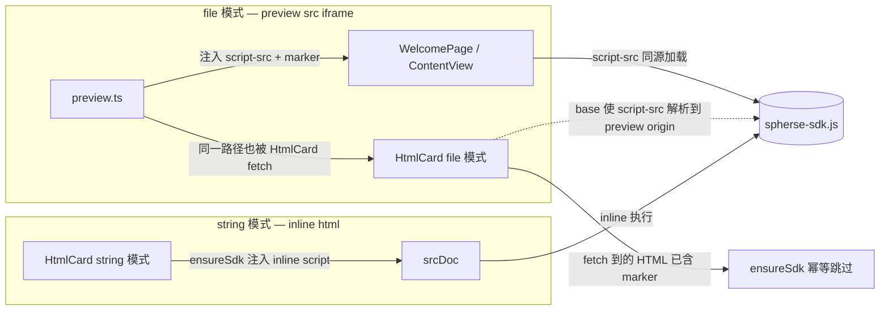

# UI SDK 健壮化 — 注入式 SDK Bridge

> 日期：2026-08-03
> 范围：将「skill 驱动 LLM 自实现 postMessage bridge」升级为「App 向用户 HTML 注入统一 SDK bridge」，让 LLM 用更少、更稳定的代码调用 App 能力，并预留 server HTTP bridge 扩展点。

> **更新（2026-08）**：SDK 运行时已从最初设想的「`@spherse/core` 内手写字符串常量 + subpath export」演化为独立 package **`@spherse/sdk`**（`packages/sdk/`），以**可读 TypeScript** 维护（`src/runtime/`：messaging/context/actions/data/api 模块），经 **esbuild** 打包为单文件 IIFE。常量重命名去掉 `SPHERSE_` 前缀（包名已命名空间化）：`SDK_VERSION` / `SDK_MARK` / `SDK_FILENAME` / `SDK_SOURCE`。下方「SDK 源码归属」「独立 subpath export」节描述的是演化前的方案，保留作历史记录；当前实现以本更新说明与 `docs/official/architecture.md` 为准。

## 背景与痛点

当前 UI SDK（`packages/app/src/ui-sdk/`）的运行时协议是 `postMessage({ type: "spherse:action", action, params, requestId })`，由全局 `useSpherseMessageListener` 接收、origin 校验、限流、分发到 `handlers/`。协议本身在三种 iframe 上下文都可用：

| 渲染路径 | 加载方式 | origin | 运行时上下文 |
|---|---|---|---|
| `HtmlCard`（file / string 模式） | `srcDoc`（经 `html-card-src.ts` 注入 `<base>`） | 继承 renderer origin | 注入 `window.__SPHERSE__` |
| `WelcomePage` / `ContentView` | `<iframe src=previewUrl>` | preview server origin | 不注入 |

**痛点**：bridge 完全由 skill 驱动，LLM 每次生成 HTML 都要内联 ~12 行 `spherseCall` Promise wrapper + runtime 读取样板；`type` 字符串、action 名均为裸字符串，拼错即静默失败；无类型/发现性；扩展靠堆 skill 文档让 LLM 记。

## 目标

1. **单一 SDK bundle**：一个无依赖 `spherse-sdk.js`，暴露 `window.spherse.*` 高层 API，内部封装 requestId 匹配、超时、runtime 竞态。
2. **注入到每个 iframe**：
   - `HtmlCard`（srcDoc）：renderer 在 `html-card-src.ts` 注入**内联** `<script>`（srcDoc 无可靠外部加载）。
   - `WelcomePage` / `ContentView`（`src` 模式）：`preview.ts` **服务端改写** HTML，注入同源 `<script src>`，保留真实 origin 不破坏同级 `fetch`。
3. **skill 瘦身**：`use-ui-sdk` 改为文档化 `window.spherse.*`，**不提供**裸 postMessage 兜底（避免 LLM 绕开 SDK 自行拼装协议引入 bug，SDK 未加载时应放宽 CSP 而非降级）。
4. **server HTTP bridge**：SDK 暴露 `spherse.api.*`，renderer 新增 `api.call` handler，按**只读白名单**经已有 `ApiClient`（自带 auth）转发。

## 设计

### SDK 源码归属（历史记录 + 演化）

**初版方案（subpath export）**：放在 `@spherse/core`（app 与 server 均直接依赖），以纯字符串常量 + 注入工具形式存在，经 `@spherse/core/ui-sdk` subpath 导出，不进 core 主 barrel。

**当前方案（`@spherse/sdk` 独立 package）**：抽到独立 workspace package `@spherse/sdk`（`packages/sdk/`），运行时以**可读 TypeScript** 维护（`src/runtime/index.ts` 入口 + `messaging.ts`/`context.ts`/`actions.ts`/`data.ts`/`api.ts` 模块），由 esbuild 打包为单文件 IIFE（`dist/browser.js`），再据此生成 `SDK_SOURCE` 字符串常量（`dist/source.js`）。抽包动机：

1. **可读性**：手写 IIFE 字符串（拼接、转义、无 IDE 支持）难以审阅与演进；TypeScript 源码获得类型检查、IDE 导航、可被测试覆盖。
2. **解耦**：与 `packages/app/src/ui-sdk/`（host 侧 listener/registry/handlers）的命名不再冲突——前者是被注入 iframe 的**客户端运行时**，后者是 renderer 内接收 `spherse:action` 的**胶水代码**，二者仅以 postMessage 协议耦合。
3. **浏览器安全（browser-safe，核心约束沿用）**：app renderer 历史上对 core 只做 `import type`（类型擦除，不进 bundle），避免把 MCP stdio client（`node:stream` 的 `PassThrough`）、`better-sqlite3`、`node:fs` 等 node-only 代码拉进 Vite 浏览器包。一旦 renderer 出现对 core 主 barrel 的**值**导入，整棵 core 运行时图都会被打包，`electron-vite build` 在 `@modelcontextresponse/sdk/dist/esm/client/stdio.js` 处因 `PassThrough` 未导出而失败。`@spherse/sdk` 是**零运行时依赖**的叶子 package，天然满足此约束，无需 subpath export 绕行。

`packages/sdk/package.json` 暴露三个 browser-safe 子入口：

- `.` → `dist/index.js`：`SDK_VERSION` / `SDK_MARK`（`data-spherse-sdk`，幂等标记）/ `SDK_FILENAME`（`__spherse-sdk.js`，preview 保留名）+ `injectHeadScript(html, scriptTag, marker)` 注入工具（marker 存在则原样返回；否则插入 `<head>` 首位，无 `<head>` 时 `<html>` 后补，再否则前置）。
- `./source` → `dist/source.js`：`SDK_SOURCE`，IIFE 形式的浏览器 JS 字符串，定义 `window.spherse`（与 `window.Spherse` 别名），提供 `call`/`fire`/`getRuntime`/`runtime`（getter）+ 命名便捷方法 + `data.*` + `api.*`。内部维护 `pending` 表匹配 `spherse:response`，10s 超时；runtime 从 `window.__SPHERSE__` 或 `spherse:runtime` message 解析（竞态安全）。
- `./browser` → `dist/browser.js`：原始 IIFE bundle（供直接 `<script src>` 服务，当前由 server 经 `SDK_SOURCE` 字符串短路返回）。

构建链（`packages/sdk/scripts/build.mjs`）：esbuild 打包 `src/runtime/index.ts` → `dist/browser.js`（IIFE，target es2019）；脚本读取产物，转义 `\` `` ` `` `${` `</script>`，写出 `dist/source.js`（`export const SDK_SOURCE = \`…\`;`）+ `dist/source.d.ts`；最后 `tsc` 编译 node-facing 模块与类型。renderer（`html-card-src.ts`）与 server（`preview.ts`）都从 `@spherse/sdk`（常量）+ `@spherse/sdk/source`（字符串）导入。

### 注入策略（关键：两种模式差异）



- **服务端注入（`preview.ts`）**：读取 html buffer → `injectHeadScript(html, <script src={sdkScriptUrl} data-spherse-sdk>, MARK)`。`sdkScriptUrl` 随请求路由分支：
  - 普通预览：`/api/projects/:projectId/preview/__spherse-sdk.js`
  - 鉴权预览（mobile/web）：`/api/projects/:projectId/preview/__auth/:token/__spherse-sdk.js`
  - 保留名 `__spherse-sdk.js` 在 `handlePreview` 早期短路，直接 `reply.send(SDK_SOURCE)`（`application/javascript`, `no-cache`）。etag 仍按文件 stat 计算（注入是文件内容的纯函数，304 语义不变）。
- **renderer 内联注入（`html-card-src.ts`）**：`ensureSdk(html)` 用同一 `injectHeadScript` 插入 `<script data-spherse-sdk>${SDK_SOURCE}</script>`；在 `buildFileSrcDoc`/`buildInlineSrcDoc` 中 `ensureCharset → ensureScrollable → ensureSdk → injectBase` 顺序调用，保证 `<base>` 最终位于 `<head>` 首位（file 模式下 base 使 server 注入的绝对路径 script-src 解析到 preview origin）。
  - **幂等关键**：file 模式下 HtmlCard fetch 到的 HTML 已含 server 注入的 marker，`ensureSdk` 跳过 → 不重复注入；string 模式无 marker → 内联注入。

### origin 与 base 解析正确性

- HtmlCard srcDoc 继承 renderer origin → SDK `postMessage` 的 `event.origin` = renderer origin → `isAllowedOrigin` 放行 ✓
- WelcomePage/ContentView src = preview origin → `event.origin` = server origin → 放行 ✓
- file 模式 HtmlCard：server 注入 `<script src="/api/...">`（绝对路径，相对解析），renderer 注入 `<base href="previewDir/">` 在其前 → 解析到 preview origin → 同源加载 ✓（默认 CSP 允许跨源 `<script src>` 执行）

### api.call 只读白名单（HTTP bridge）

`app/src/ui-sdk/handlers/api.ts`：

```ts
const ALLOWLIST: Record<string, (c: ApiClient, a: Args) => Promise<unknown>> = {
  "agents.list": (c) => c.listAgents(),
  "agents.get": (c, a) => c.getAgent(String(a.id)),
  "sessions.list": (c, a) => c.listSessions(String(a.agentId)),
  "sessions.messages": (c, a) => c.getSessionMessages(String(a.agentId), String(a.id)),
  "sessions.status": (c, a) => c.getSessionStatus(String(a.agentId), String(a.id)),
  "content.get": (c, a) => c.getContent(String(a.path)),
  "fileTree": (c) => c.getFileTree(),
};
registerAction("api.call", async ({ op, args }, ctx) => { /* 白名单查表，未知 op respond false */ });
```

- 安全：op 显式白名单（无任意路径），读操作复用 server 既有 access policy（`.spherse/` 拒绝等在 server route 层强制）。
- 限流：`api.call` 不进白名单，受每分钟 10 次限制（与其它 action 一致）。
- SDK 侧：`spherse.api.call(op, args)` + 命名便捷（`spherse.api.agents.list()` 等）。

### 向后兼容

- 协议不变（仍是 `spherse:action` / `spherse:response`），SDK 纯加法。已生成的旧 HTML（含手写 `spherseCall`）继续工作。
- SDK 载入失败（如用户 HTML 设了限制性 CSP meta 阻断同源 script）→ 该卡片不可用，应在 HTML 中放宽 CSP 允许同源 script 加载；**不提供**裸 postMessage 兜底，避免 LLM 绕开 SDK 自行拼装协议。

### 版本握手

SDK 在每条消息附带 `sdk: SDK_VERSION`；listener 当前忽略（前向兼容），未来可据此告警/分支。

## 改动清单

> 下表为初版（`@spherse/core` subpath）方案的计划清单；运行时最终抽到独立 package `@spherse/sdk`（见顶部更新说明），表中 `core/src/ui-sdk/*` 行实际落地为 `packages/sdk/src/*`（runtime 模块 + `inject-head-script` + `__tests__/`）。`triggers`/`settings` 类 API 在 review 中移除，未上线。

| 包 | 文件 | 改动 |
|---|---|---|
| core | `src/ui-sdk/sdk-runtime.ts` | 新增 |
| core | `src/ui-sdk/inject-head-script.ts` | 新增 |
| core | `src/index.ts` | 导出上述符号 |
| core | `src/__tests__/inject-head-script.test.ts` | 新增 |
| server | `src/routes/preview.ts` | 服务端注入 + 保留名服务 |
| server | `src/__tests__/preview.test.ts` | 补用例 |
| app | `src/features/chat/html-card-src.ts` | `ensureSdk` |
| app | `src/features/chat/HtmlCard.test.ts` | 补用例 |
| app | `src/ui-sdk/handlers/api.ts` | 新增 |
| app | `src/ui-sdk/handlers/api.test.ts` | 新增 |
| app | `src/ui-sdk/index.ts` | 注册 api handler |
| presets | `skills/use-ui-sdk/SKILL.md` | 重写为高层 API |
| presets | `skills/write-html/SKILL.md` | 去除内联 wrapper |
| docs/official | `architecture.md` | 更新 UI SDK 节 |
| docs/dev | `backlog.md` | 新增条目 |

## 验证

- `npm run verify`（lint + build + unit + i18n），其中 `npm test --workspace=packages/sdk` 覆盖 `inject-head-script` / `messaging` / `context` 单元测试
- 受影响 e2e：`ui-sdk.spec.ts`、`ui-sdk-html-card.spec.ts`、`ui-sdk-data-crud.spec.ts`、`ui-sdk-bridge.spec.ts`（注入式 `window.spherse.*` 桥接端到端：surface 暴露 / fire 导航 / call 往返 / api.* resolve+reject）
