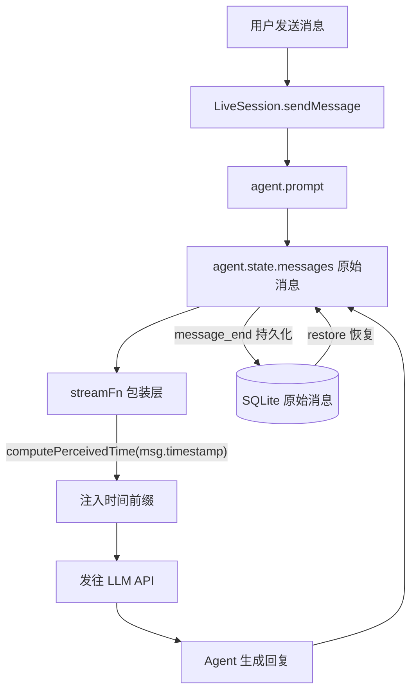

# Agent 时间感知能力

> 日期：2026-08-04
> 范围：为 Agent 提供时间感知——支持自定义时区和时间流速，使 Agent 在对话中看到的时间线可与真实世界不同步。

## 背景

当前 Agent 完全没有时间感知：

- System prompt 不注入当前时间
- 消息中不携带时间信息
- 全链路使用 `Date.now()` / `new Date()` 真实墙钟

对于角色扮演、模拟场景（如"100 年后的世界"）、测试场景（如"快进到明天"），Agent 需要感知到一个与真实世界不同的时间线。

## 核心设计

### 纯函数推导

感知时间完全由真实时间戳推导，不存在任何可变状态：

```
perceivedMs = startMs + (realMs - epochMs) × flowRate
```

| 变量 | 含义 | 默认（不启用） |
|------|------|----------------|
| `epochMs` | 锚定的真实时刻 | — |
| `startMs` | 该时刻对应的感知时间起点 | — |
| `flowRate` | 感知/真实比率，`1` = 正常速度 | — |

**不变性保证**：只要三个变量不变，同一真实时间戳每次计算出的感知时间完全一致。历史消息的感知时间不会因后续对话而漂移。

时区正交于上述公式——`perceivedMs` 产出的是 UTC epoch，时区只在格式化时参与（`Intl.DateTimeFormat({ timeZone })`）。

### StreamFn 边界注入

在 `streamFn`（agent 内部状态与 LLM API 的唯一边界）处包装，对发往 LLM 的每条 **user** 消息注入感知时间前缀。

```
agent.state.messages [原始]  ──→  streamFn 包装层  ──→  LLM 看到带时间前缀
        ↑
   持久化/恢复均操作原始消息，感知时间在边界处纯函数计算
```

**关键优势**：
- `agent.state.messages` 始终保持原始内容，零侵入
- 持久化（`appendMessage`）和恢复（`restore`）完全不需要修改
- Compaction 的 digest 基于原始消息，不会混入时间前缀
- 不需要"注入后剥离"逻辑

### 不涉及的范围

- **Trigger 系统**：Trigger 在真实墙钟运行是正确行为。Agent 的感知时间与自动化执行时刻是正交的，不修改 `TimerService` / `TriggerManager` / `cron-parser`。
- **主动查询工具**：不提供 `get_time` 工具。Agent 被动地从每条 user 消息前缀感知时间。
- **真实时间戳语义**：存储、排序、日志中的时间戳全部保持真实墙钟。

## 配置

### AgentProfile 扩展

```ts
interface TimePerceptionConfig {
  enabled: boolean;
  epochMs: number;      // 锚定的真实时刻（通常为 session/agent 创建时的 Date.now()）
  startMs: number;      // 感知时间起点（epochMs 对应的感知时间，UTC epoch ms）
  flowRate: number;     // 感知/真实比率，> 0；1 = 正常速度；0 = 冻结（禁止）
  timeZone?: string;    // IANA 时区名，如 "Asia/Shanghai"；默认系统时区
}

interface AgentProfile {
  // ...现有字段
  timePerception?: TimePerceptionConfig;
}
```

配置存储在 agent profile YAML 文件中（`.spherse/agents/{slug}.yaml`），per-agent 独立。

### 默认行为

`timePerception` 未设置或 `enabled: false` 时，行为与当前完全一致——不包装 streamFn，不注入任何时间信息。

## 实现

### 1. 纯函数模块 `time-perception.ts`

```ts
// packages/core/src/context/time-perception.ts

export function computePerceivedTime(
  realMs: number,
  config: TimePerceptionConfig,
): number {
  return config.startMs + (realMs - config.epochMs) * config.flowRate;
}

export function formatPerceivedTime(
  perceivedMs: number,
  timeZone?: string,
): string {
  const dt = new Intl.DateTimeFormat("en-US", {
    timeZone: timeZone ?? undefined,
    year: "numeric",
    month: "short",
    day: "numeric",
    hour: "2-digit",
    minute: "2-digit",
    hour12: false,
  });
  return dt.format(new Date(perceivedMs));
}

export function buildTimePrefix(
  realMs: number,
  config: TimePerceptionConfig,
): string {
  const perceived = computePerceivedTime(realMs, config);
  const formatted = formatPerceivedTime(perceived, config.timeZone);
  return `<time>${formatted}</time>`;
}
```

### 2. StreamFn 组合

streamFn 的组合逻辑集中在模块级函数 `composeStreamFn` 中，`buildAgent`（静态方法，构建时）和 `applySampling`（实例方法，热更新时）统一调用：

```ts
// packages/core/src/session/live-session.ts

function composeStreamFn(
  sampling: SamplingParams | undefined,
  timePerception: TimePerceptionConfig | undefined,
): StreamFn {
  const base = getChatStreamFn(sampling);
  return isActiveTimePerception(timePerception)
    ? wrapWithTimePerception(base, timePerception)
    : base;
}
```

`wrapWithTimePerception` 返回的包装 streamFn 在调用 LLM 前，对 `context.messages` 中每条 **user** 消息注入时间前缀（`<time>感知时间</time>`），然后委托给 base streamFn。只注入 user 消息，避免 LLM 从 assistant 历史中模仿输出时间标签。

### 3. 统一构建入口

`composeStreamFn` 是模块级函数，`buildAgent` 和 `applySampling` 统一调用：

```ts
// live-session.ts — buildAgent（静态方法）中:
const streamFn = composeStreamFn(ctx.sampling, profile.timePerception);

// applySampling（实例方法）中:
const profile = this.ctx.projectStore.getAgent(this.agentId)?.getProfile();
this.agent.streamFn = composeStreamFn(sampling, profile?.timePerception);
```

### 4. System Prompt 标记

在 `buildSessionContext` 中仅注入时间感知是否启用，不注入具体时间：

```xml
<session-context>
agent-name: ...
agent-slug: ...
session-id: ...
time-perception: enabled   <!-- 仅当 enabled 时出现 -->
Do not output <time> tags in your replies; they are metadata for your awareness only.
</session-context>
```

这让 Agent 知道消息前缀中的时间是"感知时间"，并指示 Agent 不要在自己的回复中输出 `<time>` 标签（避免 LLM 从注入格式中模仿）。

## 数据流



## 注意事项与风险

### 1. applySampling 热替换覆盖

`applySampling`（`live-session.ts:234`）会覆盖 `this.agent.streamFn`。必须确保每次替换都经过 `composeStreamFn`，否则时间感知会丢失。统一入口方案已解决此问题。

### 2. Token 开销

每条 user 消息增加约 20-30 token 的时间前缀（`<time>Aug 04, 2026, 14:30</time>`）。在长对话中累积，可能提前触发 compaction。可接受的代价——时间信息对 Agent 理解对话时序有实质价值。

### 3. Compaction 后的时间信息丢失

Compaction 的 digest 摘要的是原始消息（不含时间前缀），压缩后 Agent 在 digest 段看不到时间线。这是可接受的——compaction 本身是有损的。如需保留时间范围，可在 digest prompt 的 system 段补充"对话发生在 {起始感知时间} 至 {结束感知时间}"，但当前版本不做。

### 4. content 格式多样性

pi-ai `Message.content` 可能是 `string` 或 `ContentBlock[]`。注入逻辑需处理两种情况：

- `string`：直接前缀拼接
- `ContentBlock[]`：在数组开头插入 `{ type: "text", text: "<time>时间</time>" }` block

### 5. flowRate 边界值

- `flowRate = 0`（时间冻结）：每条消息计算出的感知时间相同，Agent 看到的时间线静止。合法但需要 UI 明确提示用户后果。
- `flowRate` 极大（如 86400 = 1 秒真实 = 1 天感知）：两条间隔 1 分钟的消息之间感知时间相差 24 小时。Agent 可能对时间跨度产生困惑。无需特殊处理，由用户自行设定合理值。

### 6. 配置变更的语义

修改 `startMs` / `epochMs` / `flowRate` 会导致历史消息的感知时间全部重算（纯函数，确定性）。这是设计特性而非 bug——用户可以随时"调整时间线"，所有历史消息的时间会自动一致更新。

### 7. 跨 session 一致性

`epochMs` 和 `startMs` 存储在 agent profile 中（per-agent），同一 agent 的所有 session 共享同一时间线配置。恢复旧 session 时，历史消息的感知时间会按当前配置重新计算——结果与该 session 运行时一致（因为配置不变时纯函数结果不变）。

## 实施计划

1. **`types.ts`**：新增 `TimePerceptionConfig` 接口，`AgentProfile` 添加 `timePerception?` 字段
2. **`context/time-perception.ts`**：纯函数模块（compute / format / prefix）+ `wrapWithTimePerception` 包装 + 单元测试
3. **`session/live-session.ts`**：模块级 `composeStreamFn` 统一组合 streamFn，`buildAgent` / `applySampling` 调用
4. **`context/blocks.ts` + `serialize.ts`**：session-context 添加 `time-perception: enabled` 标记 + 不要输出 `<time>` 标签的指令
5. **Agent profile 读写**：YAML schema 添加 `timePerception` 字段（宽容解析，缺失字段自动补默认值）
6. **前端 Agent 编辑表单**：添加时间感知配置 UI（Switch 开关 + 2×2 网格布局 + Select 时区下拉）
7. **Server contract**：`agents.ts` 添加 `timePerceptionConfig` typebox schema
