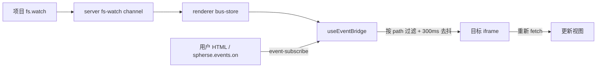

# UI SDK 文件变化事件

> 日期：2026-08-04  
> 范围：允许用户 HTML 订阅项目文件变化，在外部工具或 Agent 修改 JSON 等数据文件后主动重新读取并刷新视图。

## 背景

文件模式 HTML 可以通过 `fetch("./data.json")` 读取同目录数据，但浏览器无法感知磁盘文件何时变化。App 已有 `fs.watch → server fs-watch WebSocket → renderer bus-store` 链路，因此本功能只补齐 renderer 到 iframe 的订阅与推送能力。

## 用户 API

```js
const unsubscribe = spherse.events.on(
  "file:update",
  { path: "./data.json" },
  async ({ path }) => {
    const data = await fetch("./data.json").then((response) => response.json());
    render(data);
  },
);
```

- `./`、`../` 路径由 iframe SDK 基于 `document.baseURI` 解析，语义与同页面 `fetch` 一致。
- 不带点前缀的路径按项目根目录相对路径解释。
- handler 只收到归一化后的 `{ path }`。底层 `fs.watch` 的 `change` / `rename` 无法稳定表达业务语义，因此不对用户暴露。
- 返回的取消函数幂等；页面 `pagehide` 时 SDK 自动取消全部订阅。

## 架构



`UiSdkBridge` 是项目级 composition root，同时挂载既有 action bridge 与独立 event bridge。event 控制消息不复用 action registry，订阅状态因此可以局部归属当前项目 bridge，项目卸载时直接释放，无需全局 project 注册表。

Host 侧 event 实现位于 `packages/app/src/ui-sdk/event/`：

- `use-event-bridge.ts`：接收订阅控制消息、消费 `fs-watch` bus 并编排推送。
- `subscription-registry.ts`：按 iframe `MessageEvent.source` 保存订阅、路径过滤与定向投递。
- `types.ts`：subscribe / unsubscribe / push 协议类型。
- `file-update.ts`：路径归一化、fs-watch payload 校验与同路径 300ms 去抖。

iframe 侧由 `packages/sdk/src/runtime/events.ts` 提供 `spherse.events.on`、订阅 ID 管理、base-relative 路径解析和 handler 分发。

## 协议

订阅与取消：

```ts
{ type: "spherse:event-subscribe", subscriptionId, event: "file:update", filter: { path } }
{ type: "spherse:event-unsubscribe", subscriptionId }
```

定向推送：

```ts
{ type: "spherse:event", event: "file:update", subscriptionId, payload: { path } }
```

renderer 对控制消息复用 UI SDK 既有 origin 校验。每个 iframe 最多同时保存 100 个订阅，防止页面无限占用内存。

## 路径处理

SDK 仅对 `./` / `../` 输入读取 `document.baseURI`，从普通 preview URL 或 `preview/__auth/:token/` URL 提取并解码项目相对路径。越过 preview 根目录、非 preview base、绝对 URL 或 host 侧判定为项目外的路径均拒绝。

## 验证

- SDK 单元测试：订阅生命周期、消息分发、普通/鉴权 preview base、中文路径与越界拒绝。
- App 单元测试：路径校验、payload 解析、去抖、订阅过滤与上限。
- Electron E2E：子目录 HTML 用 `./sdk-watch.json` 订阅，磁盘写入后 iframe 收到 `{ path: "pages/sdk-watch.json" }`。
