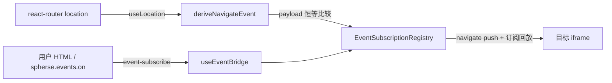

# UI SDK 导航事件

> 日期：2026-10-01
> 范围：为 UI SDK 新增 `navigate` 事件，注入 HTML 订阅后可感知宿主主视图跳转（welcome / chat / content / browser），晚加载卡片可通过订阅回放立即获知当前页面。

## 背景

SDK 事件桥目前只支持 `file:update`（事件源在 server fs-watch，经 WS bus 到 renderer）。宿主的视图跳转完全发生在 renderer 本地（react-router hash 路由），消费方 HTML 卡片无法感知"当前在哪个页面"。本功能在既有 event 桥上扩展第二种事件类型，事件源为 renderer 路由变化，不涉及 server 与 `@spherse/contracts`。

## 用户 API

```js
spherse.events.on("navigate", (e) => {
  // e.kind: "file" | "chat" | "browser" | "welcome"
  // e.kind === "file"    → e.path: "todo/事务簿.html"（content 视图，项目相对路径）
  // e.kind === "chat"    → e.sessionId
  // e.kind === "browser" → e.url（内置浏览器当前页）
  // e.kind === "welcome" → 无附加字段
});
```

- `navigate` 无 filter，`on` 第二个参数即 handler（非 function 抛既有错误码 `invalid_event_handler`），与 `file:update` 的三参形式重载共存。
- **订阅即回放（sticky）**：订阅成功时立即收到一条当前导航状态，晚加载的卡片无需等待下次跳转。
- 返回取消函数幂等；`pagehide` 时 SDK 自动取消全部订阅（复用既有机制）。

## 事件语义

路由 → payload 为判别联合（各 kind 的附加字段恒存在，无可选字段）：

| 路由 | payload |
|---|---|
| `/project/:id`（index） | `{ kind: "welcome" }` |
| `/project/:id/chat/:sessionId` | `{ kind: "chat", sessionId }` |
| `/project/:id/content?path=…` | `{ kind: "file", path }` |
| `/project/:id/browser?url=…` | `{ kind: "browser", url }` |

已确认的边界决策：

- **瞬态路由不推送**：`/content` 缺 `?path=`、`/browser` 缺 `?url=` 或 url 非 loopback 时页面会立即 `replace` 回 welcome，属于只存活一帧的瞬态。`deriveNavigateEvent` 对这类输入返回 null（不推送），避免"file → welcome"双跳噪音；也因此 `file`/`browser` 的附加字段必然存在。
- **忽略无关 query（含 `?messageId=`）**：payload 恒等比较只基于派生字段（kind/path/sessionId/url），构造上即排除 `messageId` 等无关 query——ChatPage 内 `replace` 定位消息不构成导航。恒等则不推送。
- **浮窗不发事件**：floatContent / floatSession 等浮窗是叠加层，不改变主视图路由，不触发 navigate。
- **split pane 不发事件**：split 状态在 store 不在 URL，主路由只反映主 pane；split 内切换与 split 开关均不产生事件。
- **payload 不含 projectId，跨项目隔离由 registry 生命周期保证**：同窗口项目 A→B 时 ProjectScope 不重挂、registry 实例复用；隔离依赖 `client`（依赖 projectId）重建时 `registry.clear()` 先清订阅与 `currentNavigate`，再由喂状态 effect 重新 seed，随后才有 B 路由的广播。
- 事件只反映主窗口路由；Electron 浮动窗口是独立渲染树，天然不在范围内。

## 架构



- 事件源从 bus 订阅换成 `useLocation()`（`useEventBridge` 所在 `UiSdkBridge` 挂在 ProjectScope 内，处于 router 上下文）。
- 纯函数 `deriveNavigateEvent(pathname, search)` 负责路由 → payload 映射，独立可测；非项目路由与瞬态路由返回 null 不推送。
- registry 持有 `currentNavigate`：`setNavigateCurrent(payload)` 判空/恒等比较后更新并广播；`subscribe("navigate")` 注册成功后立即向该 source 回放 `currentNavigate`（无则不回放）。回放与去重逻辑全部收敛在 registry，bridge 只负责喂状态。
- **registry 生命周期**：喂状态 effect 依赖 `[location, client]`——`client` 因重连/accessToken 刷新/projectId 变化重建时，message-listener cleanup 先 `registry.clear()`（同时重置订阅表与 `currentNavigate`），喂状态 effect 随后以当前 location 重新 seed。重连导致既有订阅被静默清除、SDK 不自动重订阅——这是与 `file:update` 共享的既有行为，本次接受不扩展。

## 协议

复用既有订阅控制消息，navigate 不携带 filter：

```ts
{ type: "spherse:event-subscribe", subscriptionId, event: "navigate" }
{ type: "spherse:event-unsubscribe", subscriptionId }
```

推送：

```ts
{ type: "spherse:event", event: "navigate", subscriptionId, payload: { kind, … } }
```

- host 侧对 navigate 订阅的 filter 校验：absent 与 `undefined` 视为无 filter（SDK `postControl` 会序列化出 `filter: undefined`），其余任何值拒绝，为未来 filter 扩展留空间。
- origin / source 校验、每 iframe 100 订阅上限复用既有逻辑（两类事件合计）。

## 验证

- SDK 单元测试：navigate 订阅生命周期（无 filter、handler 非 function 抛 `invalid_event_handler`、unsubscribe 幂等）、`spherse:event` navigate 分发。
- App 单元测试：
  - `deriveNavigateEvent` 全路由映射、瞬态路由返回 null、无关 query（messageId）不影响恒等；
  - registry navigate 订阅 / 订阅即回放 / 恒等去重 / 携带 filter 拒绝 / 与 file:update 混合订阅上限；
  - `clear()` 重置 `currentNavigate`、client 重建后重新 seed 与回放。
- E2E：srcDoc 聊天卡片订阅 navigate（验证订阅即回放 + 各视图跳转收到对应 payload）；preview 直开 HTML 形态至少手动过一遍（两种 iframe 形态 origin 校验路径一致）。

## 文档同步

- `docs/official/architecture/ui-sdk.md`：API 面 `events.on` 补 navigate；event 桥一节补 sticky 回放、filter 拒绝、payload 语义与瞬态不推送。
- `packages/presets/skills/spherse-use-ui-sdk/SKILL.md`：`events.on` 一节补 navigate 用法，注明 `kind: "file"` 指 content 视图（文件预览），与 `file:update` 的语义区别。
