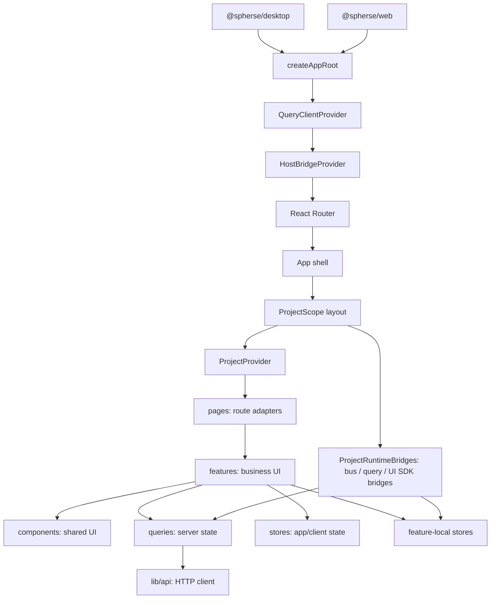

# @spherse/app

Spherse 的共享 React renderer。desktop 与 web 壳均复用本 package；这里负责路由、页面与 feature UI、服务端状态缓存、客户端状态和 UI SDK host bridge，不包含 Electron main/preload 或 Fastify 服务端实现。

对壳的公共 API 面是 package.json `exports` 白名单（`./main`、`./host-bridge`、`./stores/*`、`./ui/*` 等）：壳只从这些入口导入，禁止 `@/` 或 `@spherse/app/src` 深度导入（ESLint 在壳侧强制）；新增壳消费入口需同步维护白名单。

正式系统设计见 [`../../docs/official/README.md`](../../docs/official/README.md)（前端域：`architecture/frontend.md`、`architecture/chat.md`、`architecture/theming.md`），完整目录索引见 [`../../docs/official/project-structure.md`](../../docs/official/project-structure.md)。本文同时是 `packages/app` 的开发守则，新代码和 review 必须遵守。

已识别但尚未实施的架构优化见 [`../../docs/dev/infra/2026-08-22-frontend-architecture-followup/followup.md`](../../docs/dev/infra/2026-08-22-frontend-architecture-followup/followup.md)。

## 架构总览



依赖方向：

```text
shell -> main -> router/layout/page -> feature -> shared component/lib
                                      |      |
                                      |      +-> Zustand/client state
                                      +--------> TanStack Query/server state -> ApiClient
```

禁止 `lib/`、`components/`、全局 store 反向依赖具体 feature。跨层编排放在 `layouts/` 或自治 bridge 中。

## 目录职责

```text
src/
├── main.tsx       # renderer 入口和全局 Provider
├── router.tsx     # Hash Router 路由表
├── App.tsx        # app shell、应用级初始化和副作用
├── layouts/       # 跨 feature 的路由布局与项目生命周期编排
├── pages/         # 薄 route adapter
├── features/      # 按业务域组织的 UI、hook、局部 store
├── components/    # 跨 feature 复用组件和基础 UI
├── queries/       # TanStack Query client、key factory、查询与 mutation
├── stores/        # 应用级或跨 feature 的客户端状态
├── context/       # 稳定依赖注入
├── hooks/         # 跨 feature 通用 hooks
├── lib/           # API client、纯函数与通用基础设施
└── ui-sdk/        # iframe 与 renderer 的 action/event bridge
```

## 状态边界

先判断状态的事实来源，再选择容器：

| 状态 | 归属 | 示例 |
|---|---|---|
| 服务端、磁盘是事实源 | TanStack Query | agents、sessions、文件内容、目录列表 |
| 应用级客户端状态 | `stores/` | 打开项目、locale、side panel 状态 |
| 单个 feature 的持久客户端状态 | feature-local store | streaming、trigger 运行态、浮窗位置 |
| 组件短生命周期状态 | `useState` / `useReducer` / `useRef` | 表单 draft、弹窗、编辑 dirty/conflict |
| 稳定只读依赖 | Context | projectId/projectRoot、host bridge |

### TanStack Query

- 服务端数据不得复制进 Zustand。`project-data-store` 只保存初始消息与 streaming session id 等运行时投影。
- Query 代码统一放在 `queries/`：`client.ts` 持有单例，`keys.ts` 定义 key factory，领域文件管理查询、mutation、失效和命令式访问。
- query key 必须包含 `projectId`；关闭项目时清除该项目的全部 query cache。
- React 组件使用 query hook；UI SDK、bus callback 等非 React 边界使用 query 层提供的命令式 facade，不在调用方拼 key 或实现 cache-first fallback。
- mutation 成功后应精准更新或失效相关缓存。处理异步完成晚于项目关闭的情况，禁止迟到结果重建已清理缓存。
- WebSocket 流式事件、编辑草稿等高频或本地状态不放 Query。

### Zustand

- `app-store` 管理打开项目集合、当前项目和 host bridge 动作，不持有项目内服务端业务数据。
- `settings-store` 管理跨 feature 的 app 级设置；dialog 表单状态留在组件 hook。
- `side-panel-store` 管理 pinned、hover、mobileOpen 等跨层 UI 状态。
- 只被单个 feature 使用的状态放 `features/<name>/store.ts`。feature-local store 不应被其他 feature 或全局 store import。
- 全局 store 不得依赖 feature-local store。
- store 呿名为 `use{SemanticName}Store`，作用域由文件位置表达。
- 关闭项目时由 `layouts/project-lifecycle.ts` 的 `closeProjectCascade` 显式清理所有 per-project store 和 query cache：新增 per-project store 必须定义 `clearProject` action 并加入该清单，`project-lifecycle.structure.test.ts` 会强制检查。

## 组件与 Feature

- feature root 自治：自行从 Query、store 或 Context 获取数据，不接受父组件机械透传的环境依赖。
- 展示型子组件继续通过 props 接收数据和行为。
- App shell 只决定渲染哪些 feature 和执行应用级副作用，不做 feature 数据中转。
- 组件约 150 行是软阈值。超过时检查是否混合数据获取、状态机、布局或多个独立交互。
- 多个 state 若总在同一 handler 中联动，优先使用 reducer 或抽取 hook；多个正交弹窗可合并为枚举状态。
- handler 相互调用、effect 链或条件渲染超过三层时，优先降低认知复杂度。

## 路由

- 使用真正的嵌套路由：`project/:projectId` 是 `<ProjectScope>` layout route，通过 `<Outlet />` 渲染子页面。
- `pages/` 只解析 URL 并连接 feature，不承载业务逻辑。
- 使用 `useParams`、`useMatch`、`useSearchParams`，禁止用字符串后缀或正则手写解析当前路由。
- session id 使用 path param：`:sessionId`；文件路径使用 query param：`?path=`。

## 依赖注入

- `ProjectProvider` 在 `ProjectScope` 挂载，提供稳定的 `projectId` 与 `projectRoot`。
- 深层组件直接通过 `useProjectCtx()` 获取项目环境，不经 props 逐层透传。
- `HostBridgeProvider` 提供 desktop/web host 能力。
- Context 只注入生命周期内稳定、只读的依赖；响应式业务状态使用 Query 或 store。

## Effect 规则

- effect 依赖数组只放引用稳定的值，如 `projectId`、稳定 store action、`client`。
- 不依赖整个 store 对象引用，应选择具体字段或 action。
- event callback 需要最新翻译函数或值时，用 ref 镜像，避免把不稳定引用加入订阅 effect。
- 数据读取优先使用 Query，不在组件中重复手写 `loading -> fetch -> catch -> finally`。
- 所有异步 effect 必须处理卸载、切换参数和旧响应覆盖新状态的问题。

## 样式

- 使用 Tailwind CSS v4 工具类和 CSS 变量，不新增业务原生 CSS class。
- 颜色只使用 shadcn 语义 token（如 `bg-background`、`text-foreground`、`border-border`）和 Spherse token，不硬编码颜色值。
- 间距、圆角、阴影使用 Tailwind 标准 scale，避免 magic number。
- 业务组件不使用 `dark:`；暗色适配由 CSS 变量完成。
- 使用逻辑属性支持 RTL：`ms/me`、`ps/pe`、`start/end`、`text-start/text-end`。
- 新颜色在 `styles.css` 注册 `--sp-*` 和对应 `--color-*`。
- 修改主题 token、可主题化 `data-*` hook、聊天 DOM/布局时，同步检查 `packages/presets/skills/spherse-create-ui-theme/` 与 `spherse-create-agent-chat-theme/`。
- 可能受用户主题 `transform/filter/backdrop-filter` 影响的全屏浮层必须 portal 到 `document.body`。

## API 与 i18n

- HTTP/WebSocket 边界复用 `@spherse/server/contracts` 的 schema/parser，不新增裸 `JSON.parse` 或仅靠 TypeScript 泛型的边界校验。
- 用户可见文案必须进入 `@spherse/i18n`。
- `packages/i18n/src/locales/zh-CN.ts` 是翻译基准；新增文案要写清 UI 位置、上下文和交互状态注释，并同步其他语言。

## 测试与验证

```bash
npm test --workspace=packages/app
npm run lint --workspace=packages/app
npm run build --workspace=packages/desktop
```

- 修改 Query/store/reducer 时补充对应单元测试，覆盖项目隔离、失效、竞态和清理。
- Query 相关测试应每测试新建 QueryClient，或在 `beforeEach` 显式清空共享 test cache，禁止跨测试泄漏状态。
- 按影响面运行 Electron E2E。涉及项目恢复、路由、文件树、content browser、chat/session 或 UI SDK 时，优先运行对应 spec。
- 合并或发布前运行根目录 `npm run verify:e2e`。

## 开发检查清单

1. 状态是否放在正确层，是否产生第二份服务端真相？
2. query key 是否包含 projectId，mutation/事件是否正确失效缓存？
3. 项目关闭、路由切换和组件卸载后，迟到异步结果是否安全？
4. page 是否保持为薄 adapter，feature 是否自治？
5. effect 依赖是否稳定，是否存在重复请求或 effect 链？
6. 新 UI 是否满足语义 token、RTL、主题 hook 和 portal 约束？
7. contracts、i18n、官方文档、backlog 和受影响测试是否同步？
